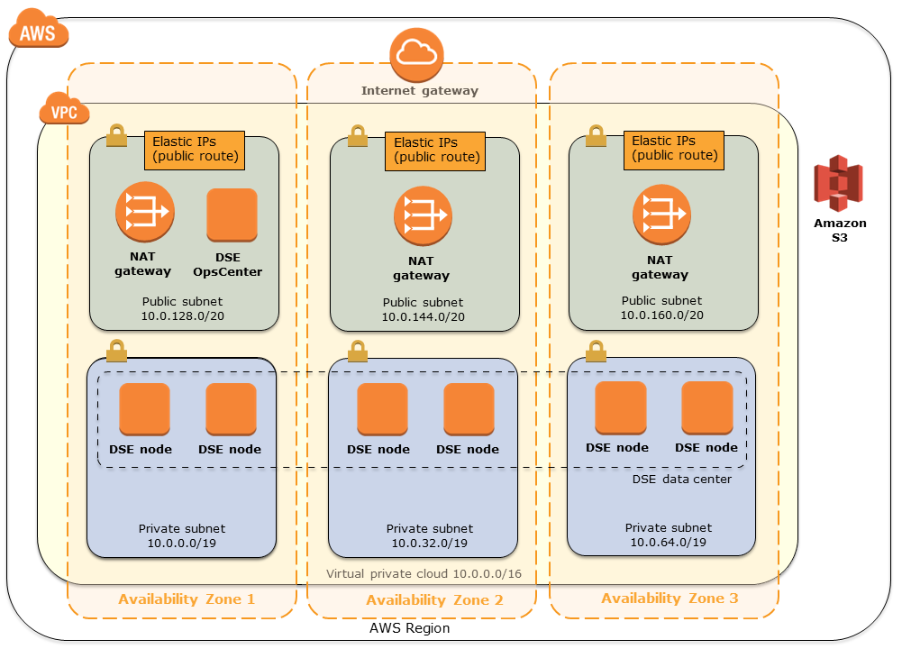
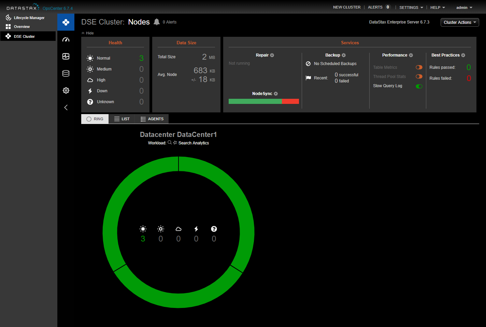
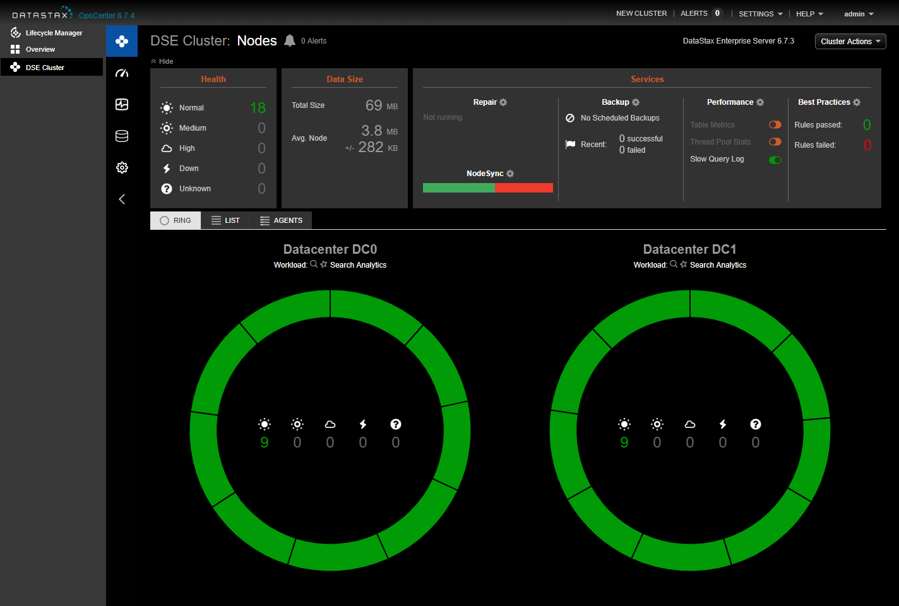

<H1>DataStax Enterprise (DSE) on the AWS Cloud</H1>

<H2>Quick Start Reference Deployment</H2>

June 2017

(last update: Jun 2019)

DataStax, Inc.

AWS Quick Start Reference Team

&nbsp;
&nbsp;

- [Overview](#overview)
  - [Costs and Licenses](#costs-and-licenses)
- [Architecture](#architecture)
  - [DSE Data Centers and Nodes](#dse-data-centers-and-nodes)
- [Prerequisites](#prerequisites)
  - [Specialized Knowledge](#specialized-knowledge)
  - [Technical Requirements](#technical-requirements)
- [Deployment Options](#deployment-options)
- [Deployment Steps](#deployment-steps)
  - [Step 1. Prepare Your AWS Account](#step-1-prepare-your-aws-account)
  - [Step 2. Create a DataStax Academy Account](#step-2-create-a-datastax-academy-account)
  - [Step 3. Launch the Quick Start](#step-3-launch-the-quick-start)
  - [Step 4. Test the Deployment](#step-4-test-the-deployment)
  - [Step 5. Back up Your Data](#step-5-back-up-your-data)
- [Troubleshooting](#troubleshooting)
- [Additional Resources](#additional-resources)
  - [Send Us Feedback](#send-us-feedback)
  - [Document Revisions](#document-revisions)

This Quick Start deployment guide was created by Amazon Web Services (AWS) in partnership with DataStax, Inc.

# Overview

This Quick Start reference deployment guide provides step-by-step instructions for deploying DataStax Enterprise (DSE) on the Amazon Web Services (AWS) Cloud.

DataStax Enterprise (DSE) is the always-on data platform for cloud applications powered by the industry&#39;s best version of Apache Cassandra. DSE is designed to handle big data workloads across multiple nodes with no single point of failure. DSE addresses the problem of failures by employing a peer-to-peer distributed system across homogeneous nodes where data is distributed among all nodes in the cluster. DSE offers advanced functionality designed to accelerate your ability to create intelligent and compelling cloud applications. Integrated within each node of DSE is powerful indexing, search, analytics, and graph functionality, provided by combining Cassandra with Apache Solr, Apache Spark, and DSE Graph. You can write data once, and access it using a variety of workloads or access patterns, all from a single cohesive solution.

[Quick Starts](https://aws.amazon.com/quickstart/?quickstart-all.q=dse) are automated reference deployments that use AWS CloudFormation templates to launch, configure, and run the AWS compute, network, storage, and other services required to deploy a specific workload on AWS.

This Quick Start is for users who need an easily deployed DSE cluster for development or testing purposes

## Costs and Licenses

You are responsible for the cost of the AWS services used while running this Quick Start reference deployment. There is no additional cost for using the Quick Start.

The AWS CloudFormation template for this Quick Start includes configuration parameters that you can customize. Some of these settings, such as instance type, will affect the cost of deployment. For cost estimates, see the pricing pages for each AWS service you will be using.

This Quick Start includes a limited no-fee license from DataStax. As described in section 1.4 of [DataStax Enterprise Terms](http://www.datastax.com/enterprise-terms), the limited license is for development or non-production use.  To use the Quick Start to build a production environment, you&#39;ll need to acquire a DataStax subscription license.
&nbsp;

# Architecture

Deploying this Quick Start for a new virtual private cloud (VPC) with **default parameters** builds the following DataStax Enterprise environment in the AWS Cloud.

<b>Figure 1: Quick Start architecture for DSE on AWS</b>

The Quick Start sets up the following components. (The template that deploys the Quick Start into an existing VPC skips the components marked by asterisks.)

- A highly available architecture that spans three Availability Zones.\*
- A VPC configured with public and private subnets according to AWS best practices, to provide you with your own virtual network on AWS. For more information about the VPC infrastructure, see the [Amazon VPC Quick Start](https://aws.amazon.com/quickstart/architecture/vpc/).\*
- An Internet gateway to allow access to the Internet.\*
- Managed NAT gateways to allow outbound Internet access for resources in the private subnets.\*
- One EC2 instance running DSE OpsCenter, which is the DSE cluster management web console.
- Additional EC2 instances for DSE data centers and nodes, depending on your Quick Start parameter settings. (A DSE data center is a logical grouping of nodes for workload separation, as explained in the next section.) For example, if you set the **1st Data Center Size** parameter to 9 and **2nd Data Center Size** parameter to 6 nodes, the Quick Start will create 15 EC2 instances. By default, the Quick Start creates a single data center with three nodes.
- One Amazon Elastic Block Store (Amazon EBS) data volume per node instance deployed.

## DSE Data Centers and Nodes

DSE data centers are logical groupings of individual nodes and can be either physical or virtual. This Quick Start supports multiple DSE data centers for workload separation. Using separate data centers prevents Cassandra transactions from being affected by other workloads.

DSE stores data replicas on multiple nodes to ensure reliability and fault tolerance. A replication strategy determines the nodes where replicas are placed. The replication strategy is defined per keyspace, and is set during keyspace creation. This Quick Start places nodes into DSE _racks_, where each rack is an AWS Availability Zone. This architecture allows for the use of a replication strategy called [NetworkTopologyStrategy](https://docs.datastax.com/en/dse/6.7/dse-arch/datastax_enterprise/dbArch/archDataDistributeReplication.html#archDataDistributeReplication__nts), which will place a copy of each row of data in each rack or Availability Zone.
&nbsp;

# Prerequisites

## Specialized Knowledge

Before you deploy this Quick Start, we recommend that you become familiar with the following AWS services. (If you are new to AWS, see [Getting Started with AWS](https://docs.aws.amazon.com/gettingstarted/latest/awsgsg-intro/intro.html).)

- [Amazon VPC](https://aws.amazon.com/documentation/vpc/)
- [Amazon EC2](https://aws.amazon.com/documentation/ec2/)
- [Amazon EBS](https://docs.aws.amazon.com/AWSEC2/latest/UserGuide/AmazonEBS.html)

We also recommend that you become familiar with the features and configuration of DSE.

- [DataStax Enterprise documentation](http://docs.datastax.com/)

## Technical Requirements

This Quick Start uses a Linux AMI (Ubuntu 16.04 LTS) for EC2 instances, and creates EBS volumes and an S3 bucket. The account you run this Quick Start in must have authorization to create these resources.

You&#39;ll also need an account on [academy.datastax.com](http://academy.datastax.com) to download packages during the installation steps.
&nbsp;

# Deployment Options

This Quick Start provides two deployment options:

- **Deploy DSE into a new VPC** (end-to-end deployment). This option builds a new AWS environment consisting of the VPC, subnets, NAT gateways, security groups, and other infrastructure components, and then deploys DSE into this new VPC.
- **Deploy DSE into an existing VPC**. This option provisions DSE in your existing AWS infrastructure.

The Quick Start provides separate templates for these options. It also lets you configure CIDR blocks, instance types, and DSE settings, as discussed later in this guide.
&nbsp;

# Deployment Steps

## Step 1. Prepare Your AWS Account

1. If you don&#39;t already have an AWS account, create one at [https://aws.amazon.com](https://aws.amazon.com) by following the on-screen instructions.
2. Use the region selector in the navigation bar to choose the AWS Region where you want to deploy DSE on AWS.
3. Create a [key pair](https://docs.aws.amazon.com/AWSEC2/latest/UserGuide/ec2-key-pairs.html) in your preferred region.
4. If necessary, [request a service limit increase](https://console.aws.amazon.com/support/home#/case/create?issueType=service-limit-increase&amp;limitType=service-code-) for the Amazon EC2 **m4.large** instance type. You might need to do this if you already have an existing deployment that uses this instance type, and you think you might exceed the [default limit](http://docs.aws.amazon.com/AWSEC2/latest/UserGuide/ec2-resource-limits.html) with this reference deployment.

## Step 2. Create a DataStax Academy Account

- Sign up for an account on [academy.datastax.com](http://academy.datastax.com). This account is necessary for downloading DSE packages for this Quick Start. You&#39;ll be prompted for your credentials in step 3.

## Step 3. Launch the Quick Start

> **Note**    You are responsible for the cost of the AWS services used while running this Quick Start reference deployment. There is no additional cost for using this Quick Start. For full details, see the pricing pages for each AWS service you will be using in this Quick Start. Prices are subject to change.

1. Choose one of the following options to launch the AWS CloudFormation template into your AWS account. For help choosing an option, see deployment options earlier in this guide.

| Option 1 - Deploy DSE into a new VPC on AWS | Option 2 - Deploy DSE into an existing VPC on AWS |
| :-----------------------------------------: | :-----------------------------------------------: |
|       [Launch](https://fwd.aws/mR5pP)       |          [Launch](https://fwd.aws/eq4AJ)          |

> **Important**     If you&#39;re deploying DSE into an existing VPC, make sure that your VPC has two (and preferably three) private subnets in different Availability Zones for the node instances. These subnets require [NAT gateways](https://docs.aws.amazon.com/vpc/latest/userguide/vpc-nat-gateway.html) or [NAT instances](https://docs.aws.amazon.com/vpc/latest/userguide/VPC_NAT_Instance.html) in their route tables, to allow the instances to download packages and software without exposing them to the Internet. You&#39;ll also need the domain name option configured in the DHCP options, as explained in the [Amazon VPC documentation](http://docs.aws.amazon.com/AmazonVPC/latest/UserGuide/VPC_DHCP_Options.html). You&#39;ll be prompted for your VPC settings when you launch the Quick Start.

Each deployment takes about 20-30 minutes to complete, depending on the size of the DSE cluster to deploy.

1. Check the region that&#39;s displayed in the upper-right corner of the navigation bar, and change it if necessary. This is where the network infrastructure for DSE will be built. The template is launched in the US East (Ohio) Region by default.
2. On the **Select Template** page, keep the default setting for the template URL, and then choose **Next**.
3. On the **Specify Details** page, change the stack name if needed. Review the parameters for the template. Provide values for the parameters that require input. For all other parameters, review the default settings and customize them as necessary. When you finish reviewing and customizing the parameters, choose **Next**.

In the following tables, parameters are listed by category and described separately for the two deployment options. Parameters for deploying DSE into a new VPC and Parameters for deploying DSE into an existing VPC

- **Option 1: Parameters for deploying DSE into a new VPC**

[View template](https://fwd.aws/DyGDb)

_**VPC Network Configuration:**_

| Parameter label (name) | Default | Description |
| --- | :---: | --- |
| Availability Zones (AvailabilityZones) | _Requires input_ | The list of Availability Zones to use for the subnets in the VPC. The Quick Start uses three Availability Zones from your list and preserves the logical order you specify. |
| Permitted IP range (AccessLocation) | _Requires input_ | The CIDR IP range that is permitted to access the DSE OpsCenter web console or SSH to the EC2 instance for the console. We recommend that you set this value to a trusted IP range. For example, you might want to grant only your corporate network access to the software. |

_**DataStax Setup:**_

| Parameter label (name) | Default | Description |
| --- | :---: | --- |
| Cluster Name (ClusterName) | DSE Cluster | The name of the DSE cluster. This is the name used by DSE OpsCenter. |
| Key Name (KeyPairName) | _Requires input_ | Public/private key pair, which allows you to connect securely to your instance after it launches. When you created an AWS account, this is the key pair you created in your preferred region. |
| DataStax Academy Username (DSAcademyUser) | _Requires input_ | User name for your academy.datastax.com account, from step 2. |
| DataStax Academy Password (DSAcademyPW) | _Requires input_ | Password for your academy.datastax.com account, from step 2. |
| DSE Version(DSEVersion) | 6.7.3 | DSE version to install. |
| Database Password (DBPassword) | _Requires input_ | The password for the default Cassandra user. |

_**OpsCenter Setup:**_

| Parameter label (name)                          | Default          | Description                                                  |
| ----------------------------------------------- | :----------------: | ------------------------------------------------------------ |
| OpsCenter Instance Type (OpsCenterInstanceType) | m4.2xlarge       | EC2 instance type for the OpsCenter node in the DSE data center. |
| OpsCenter Password (OpsCPassword)               | *Requires input* | Password for default DSE OpsCenter administrator.            |

_**1st Data Center & Node Setup:**_

| Parameter label (name)       |  Default  | Description                                                  |
| ---------------------------- | :-------: | ------------------------------------------------------------ |
| Data Center Size(DC0Size)    |     3     | The number of nodes to create in the 1st DSE data center.    |
| Data Center Name (DC0Name)   |    DC0    | Name of the 1st DSE data center.                             |
| Instance Types(DC0Instance)  | m4.xlarge | EC2 instance type for the nodes in the 1st DSE data center.  |
| Volume Sizes (DC0VolumeSize) |   1024    | The EBS volume size, in GiB, for the nodes in 1st DSE data center. |

_**2nd Data Center & Node Setup:**_

| Parameter label (name)       | Default | Description                                                  |
| ---------------------------- | :-----: | ------------------------------------------------------------ |
| Data Center Size(DC1Size)    |    0    | The number of nodes to create in the 2nd DSE data center. Select 0 if you need only 1 data center. If you want to split your workloads with different set of nodes, you can choose to deploy a 2nd data center. The 2nd data center can have different configuration i.e instance type, volume size etc. for the nodes. |
| Data Center Name (DC1Name)   |         | Name of the 2nd DSE data center.                             |
| Instance Types(DC1Instance)  |         | EC2 instance type for the nodes in the 2nd DSE data center.  |
| Volume Sizes (DC1VolumeSize) |         | The EBS volume size, in GiB, for the nodes in 2nd DSE data center. |

_**AWS Quick Start Configuration:**_

| Parameter label (name) | Default | Description |
| --- | :---: | --- |
| Quick Start S3 Bucket Name (QSS3BucketName) | quickstart-reference | S3 bucket where the Quick Start templates and scripts are installed. Use this parameter to specify the S3 bucket name you&#39;ve created for your copy of Quick Start assets, if you decide to customize or extend the Quick Start for your own use. The bucket name can include numbers, lowercase letters, uppercase letters, and hyphens, but should not start or end with a hyphen. |
| Quick Start S3 Key Prefix (QSS3KeyPrefix) | datastax/latest/ | The [S3 key name prefix](https://docs.aws.amazon.com/AmazonS3/latest/dev/UsingMetadata.html) used to simulate a folder for your copy of Quick Start assets, if you decide to customize or extend the Quick Start for your own use. This prefix can include numbers, lowercase letters, uppercase letters, hyphens, and forward slashes. |

 

- **Option 2: Parameters for deploying DSE into an existing VPC**

[View template](https://fwd.aws/Dz54E)

_**VPC Network Configuration:**_

| Parameter label (name) | Default | Description |
| --- | :---: | --- |
| Availability Zones (AvailabilityZones) | _Requires input_ | The list of Availability Zones to use for the subnets in the VPC. The Quick Start uses three Availability Zones from your list and preserves the logical order you specify. |
| Permitted IP range (AccessLocation) | _Requires input_ | The CIDR IP range that is permitted to access the DSE OpsCenter web console or SSH to the EC2 instance for the console. We recommend that you set this value to a trusted IP range. For example, you might want to grant only your corporate network access to the software. |
| VPC CIDR (VPCCIDR) | _Requires input_ | CIDR block for your existing VPC. |
| Private Subnets (PrivateSubnets) | _Requires input_ | List of private subnet IDs in your existing VPC.  The Quick Start will deploy the DSE data centers into these subnets. |
| Public Subnet ID (PublicSubnetId) | _Requires input_ | ID of a public subnet in your existing VPC (e.g., subnet-b58c3d67). This is where the DSE OpsCenter instance will be deployed. |
| VPC ID (VPCID) | _Requires input_ | ID of your existing VPC (e.g., vpc-0343606e). |

_**DataStax Setup:**_

| Parameter label (name) | Default | Description |
| --- | :---: | --- |
| Cluster Name (ClusterName) | DSE Cluster | The name of the DSE cluster. This is the name used by DSE OpsCenter. |
| Key Name (KeyPairName) | _Requires input_ | Public/private key pair, which allows you to connect securely to your instance after it launches. When you created an AWS account, this is the key pair you created in your preferred region. |
| DataStax Academy Username (DSAcademyUser) | _Requires input_ | User name for your academy.datastax.com account, from step 2. |
| DataStax Academy Password (DSAcademyPW) | _Requires input_ | Password for your academy.datastax.com account, from step 2. |
| DSE Version(DSEVersion) | 6.7.3 | DSE version to install. |
| Database Password (DBPassword) | _Requires input_ | The password for the default Cassandra user. |

_**OpsCenter Setup:**_

| Parameter label (name)                          | Default          | Description                                                  |
| ----------------------------------------------- | :----------------: | ------------------------------------------------------------ |
| OpsCenter Instance Type (OpsCenterInstanceType) | m4.2xlarge       | EC2 instance type for the OpsCenter node in the DSE data center. |
| OpsCenter Password (OpsCPassword)               | *Requires input* | Password for default DSE OpsCenter administrator.            |

_**1st Data Center & Node Setup:**_

| Parameter label (name)       |  Default  | Description                                                  |
| ---------------------------- | :-------: | ------------------------------------------------------------ |
| Data Center Size(DC0Size)    |     3     | The number of nodes to create in the 1st DSE data center.    |
| Data Center Name (DC0Name)   |    DC0    | Name of the 1st DSE data center.                             |
| Instance Types(DC0Instance)  | m4.xlarge | EC2 instance type for the nodes in the 1st DSE data center.  |
| Volume Sizes (DC0VolumeSize) |   1024    | The EBS volume size, in GiB, for the nodes in 1st DSE data center. |

_**2nd Data Center & Node Setup:**_

| Parameter label (name)       | Default | Description                                                  |
| ---------------------------- | :-----: | ------------------------------------------------------------ |
| Data Center Size(DC1Size)    |    0    | The number of nodes to create in the 2nd DSE data center. Select 0 if you need only 1 data center. If you want to split your workloads with different set of nodes, you can choose to deploy a 2nd data center. The 2nd data center can have different configuration i.e instance type, volume size etc. for the nodes. |
| Data Center Name (DC1Name)   |         | Name of the 2nd DSE data center.                             |
| Instance Types(DC1Instance)  |         | EC2 instance type for the nodes in the 2nd DSE data center.  |
| Volume Sizes (DC1VolumeSize) |         | The EBS volume size, in GiB, for the nodes in 2nd DSE data center. |

_**AWS Quick Start Configuration:**_

| Parameter label (name) | Default | Description |
| ---------------------- | :-------: | ----------- |
| Quick Start S3 Bucket Name (QSS3BucketName) | quickstart-reference | S3 bucket where the Quick Start templates and scripts are installed. Use this parameter to specify the S3 bucket name you&#39;ve created for your copy of Quick Start assets, if you decide to customize or extend the Quick Start for your own use. The bucket name can include numbers, lowercase letters, uppercase letters, and hyphens, but should not start or end with a hyphen. |
| Quick Start S3 Key Prefix (QSS3KeyPrefix) | datastax/latest/ | The [S3 key name prefix](https://docs.aws.amazon.com/AmazonS3/latest/dev/UsingMetadata.html) used to simulate a folder for your copy of Quick Start assets, if you decide to customize or extend the Quick Start for your own use. This prefix can include numbers, lowercase letters, uppercase letters, hyphens, and forward slashes. |

1. On the **Options** page, you can [specify tags](https://docs.aws.amazon.com/AWSCloudFormation/latest/UserGuide/aws-properties-resource-tags.html) (key-value pairs) for resources in your stack and [set advanced options](https://docs.aws.amazon.com/AWSCloudFormation/latest/UserGuide/cfn-console-add-tags.html). When you&#39;re done, choose **Next**.
2. On the **Review** page, review and confirm the template settings. Under **Capabilities** , select the check box to acknowledge that the template will create IAM resources.
3. Choose **Create** to deploy the stack.
4. Monitor the status of the stack.

This deployment uses nested stacks. In addition to the root stack, you&#39;ll see a VPC stack (if you choose to deploy the Quick Start into a new VPC), a DSE OpsCenter stack and one or more data center stacks. When the status of the root stack is **CREATE\_COMPLETE** , the installation of DSE OpsCenter is complete, all node instances have been created, and DSE has been installed and configured on all nodes by OpsCenter&#39;s [Lifecycle Manager](https://docs.datastax.com/en/latest-opsc/opsc/LCM/opscLCM.html).

1. Use the _OpsCenterURL_ displayed in the **Outputs** tab for the stack to view the DSE OpsCenter console. OpsCenter uses a self-signed SSL certificate, so you will need to accept the certificate exception. After this you can log in with the user name _admin_ and the password you specified in the **OpsCPassword** parameter when you launched the Quick Start.

> **Important**    For production environments, we recommend that you replace the self-signed certificate with one that is issued from a trusted certificate authority (CA) .

If you selected 1 data center and don&#39;t see the complete cluster, as illustrated in Figure 2, see the _Troubleshooting_ section.

<b>Figure 2: Viewing the cluster in DSE OpsCenter</b>

If you selected 2 data centers and don&#39;t see the complete cluster, as illustrated in Figure 3, see the _Troubleshooting_ section.

<b>Figure 3: Viewing the cluster in DSE OpsCenter</b>

## Step 4. Test the Deployment

After you deploy the DSE cluster, the quickest way to begin using the cluster is to use SSH to connect to the OpsCenter instance and then to one of the node instances. You can use either [SSH agent forwarding](https://aws.amazon.com/blogs/security/securely-connect-to-linux-instances-running-in-a-private-amazon-vpc/) or the key pair generated for DSE Lifecycle Manager (replacing the key and IP values for those of your cluster):
~~~shell
ssh -i $KEY_FILE ubuntu@$OPSC_IP
~~~

Once logged into the opscenter instance, run

~~~shell
ssh -i ~/.ssh/lcm.pem ubuntu@$NODE_IP
~~~

You can then start the Cassandra Query Language (CQL) shell as follows:
~~~shell
~$ cqlsh -u cassandra

Password:

Connected to DSE Cluster at 127.0.0.1:9042.

[cqlsh 5.0.1 | Cassandra 3.10.0.1652 | DSE 5.1.0 | CQL spec 3.4.4 | Native protocol v4]

Use HELP for help.

cassandra@cqlsh>
~~~

In addition to supporting Cassandra, DSE integrates Apache Solr and Apache Spark, and provides graph capabilities with DSE Graph. The DataStax website provides full [documentation](http://docs.datastax.com) and [tutorials](http://academy.datastax.com). However, note the following two points specific to this deployment:

- Internal authentication is on by default, so all commands to start a given shell require credentials. For example, the command to start the PySpark shell is:

~~~shell
dse -u cassandra pyspark
~~~

At this time, authentication for the _gremlin-console_ requires adding credentials to a configuration file, as described in the [DataStax documentation](https://docs.datastax.com/en/dse/5.1/dse-admin/datastax_enterprise/security/secDSEGraphCred.html).

- DSE nodes have no public IP addresses. Access to the web consoles for Solr or Spark can be established via an SSH tunnel.  For example, you can access the Solr console from _http://NODE_IP:8983/solr/_. You can bind to a local port with a command like this (replacing the key and IP values for those of your cluster):

~~~shell
ssh -v -i $KEY_FILE -L 8983:$NODE_IP:8983 ubuntu@$OPSC_PUBLIC_IP -N
~~~

The Solr console is then accessible at _http://127.0.0.1:8983/solr/_.  When you&#39;re prompted to log in, enter the user name _cassandra_ and the password you chose.

## Step 5. Back up Your Data

OpsCenter supports backing up data on the instances themselves, see [Adding a local file system backup location](https://docs.datastax.com/en/opscenter/6.7/opsc/online_help/services/opscBackupServiceAddLocalFSLocation.html) or to Amazon Simple Storage Service  Amazon S3 backup location, see [Adding an Amazon S3 backup location](https://docs.datastax.com/en/opscenter/6.7/opsc/online_help/services/opscBackupServiceAddS3Location.html)
&nbsp;

# Troubleshooting

**Q.** I encountered a CREATE\_FAILED error when I launched the Quick Start. What should I do?

**A.** If AWS CloudFormation fails to create the stack, we recommend that you relaunch the template with **Rollback on failure** set to **No**. (This setting is under **Advanced** in the AWS CloudFormation console, **Options** page.) With this setting, the stack&#39;s state will be retained and the instance will be left running, so you can troubleshoot the issue. (You&#39;ll want to look at the log files in %ProgramFiles%\Amazon\EC2ConfigService and C:\cfn\log.)

> **Important**   When you set **Rollback on failure** to **No** , you&#39;ll continue to incur AWS charges for this stack. Please make sure to delete the stack when you&#39;ve finished troubleshooting.

For additional information, see [Troubleshooting AWS CloudFormation](https://docs.aws.amazon.com/AWSCloudFormation/latest/UserGuide/troubleshooting.html) on the AWS website or contact us on the [AWS Quick Start Discussion Forum](https://forums.aws.amazon.com/forum.jspa?forumID=178).

**Q.** The stacks all report CREATE\_COMPLETE, but I don&#39;t see my cluster in DSE OpsCenter.

**A.** After all AWS resources are created, the final installation of DSE is performed by OpsCenter&#39;s [Lifecycle Manager](https://docs.datastax.com/en/latest-opsc/opsc/LCM/opscLCM.html) (LCM). Specifically, LCM uses SSH to connect to the nodes, installs DSE packages, and sets the appropriate configuration. If the LCM installation fails, you&#39;ll be presented with the option to either create a new cluster or manage an existing cluster. Choose **Create a new cluster** to bring up the LCM console.

The **Jobs** tab of LCM provides detailed logs of the installation. Choose the installation job for an individual node to see the individual steps performed by the job along with output and any diagnostic messages. You might have encountered a temporary error, so your first option should be to rerun the installation job.

Another possible cause of failure is an incorrect value for the **DSAcademyUser** or **DSAcademyPW** parameter during Quick Start deployment. This will show as an apt-get error. Correct these values in the **Repositories** tab and rerun the installation job.

**Q.** I encountered a size limitation error when I deployed the AWS Cloudformation templates.

**A.** We recommend that you launch the Quick Start templates from the location we&#39;ve provided or from another S3 bucket. If you deploy the templates from a local copy on your computer, you might encounter template size limitations when you create the stack. For more information about AWS CloudFormation limits, see the [AWS documentation](http://docs.aws.amazon.com/AWSCloudFormation/latest/UserGuide/cloudformation-limits.html).
&nbsp;

# Additional Resources

**AWS services**

- AWS CloudFormation
[https://aws.amazon.com/documentation/cloudformation/](https://aws.amazon.com/documentation/cloudformation/)
- Amazon EC2
[https://docs.aws.amazon.com/AWSEC2/latest/WindowsGuide/](https://docs.aws.amazon.com/AWSEC2/latest/WindowsGuide/)
- Amazon VPC
[https://aws.amazon.com/documentation/vpc/](https://aws.amazon.com/documentation/vpc/)

**DSE**

- DSE documentation
[http://docs.datastax.com/](http://docs.datastax.com/)
- DataStax Academy online courses and tutorials
[https://academy.datastax.com/](https://academy.datastax.com/)
- DSE OpsCenter User Guide
<https://docs.datastax.com/en/landing_page/doc/landing_page/docList.html#docList__opscenter>

**Quick Start reference deployments**

- AWS Quick Start home page
[https://aws.amazon.com/quickstart/](https://aws.amazon.com/quickstart/)
&nbsp;

## Send Us Feedback

You can visit our [GitHub repository](https://github.com/aws-quickstart/quickstart-datastax) to download the templates and scripts for this Quick Start, to post your comments, and to share your customizations with others.
&nbsp;

## Document Revisions

| Date | Change | In sections |
| --- | --- | --- |
| June 2017 | Initial publication | — |
| May 2018 | Additional version parameter (DSEVersion) | [Step 3. Launch the Quick Start](#step-3-launch-the-quick-start) |
| Jun 2019 | Updated parameters. Added images of OpsCenter with 2 data centers | [Step 3. Launch the Quick Start](#step-3-launch-the-quick-start) |

 
 
 
 
 
 
© 2018, Amazon Web Services, Inc. or its affiliates, and DataStax, Inc. All rights reserved.

<u>**Notices**</u>

This document is provided for informational purposes only. It represents AWS’s current product offerings and practices as of the date of issue of this document, which are subject to change without notice. Customers are responsible for making their own independent assessment of the information in this document and any use of AWS’s products or services, each of which is provided “as is” without warranty of any kind, whether express or implied. This document does not create any warranties, representations, contractual commitments, conditions or assurances from AWS, its affiliates, suppliers or licensors. The responsibilities and liabilities of AWS to its customers are controlled by AWS agreements, and this document is not part of, nor does it modify, any agreement between AWS and its customers.

The software included with this paper is licensed under the Apache License, Version 2.0 (the "License"). You may not use this file except in compliance with the License. A copy of the License is located at [http://aws.amazon.com/apache2.0/](http://aws.amazon.com/apache2.0/) or in the "license" file accompanying this file. This code is distributed on an "AS IS" BASIS, WITHOUT WARRANTIES OR CONDITIONS OF ANY KIND, either express or implied. See the License for the specific language governing permissions and limitations under the License.
