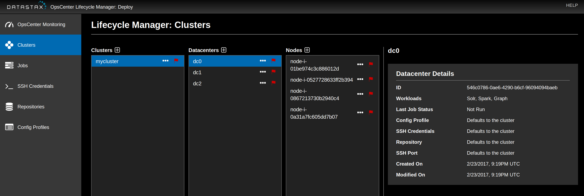
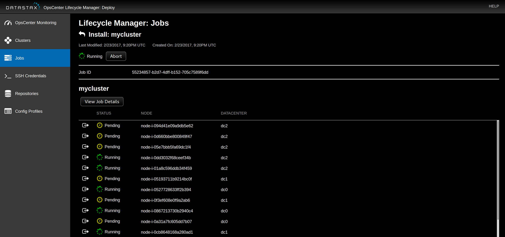

# Info and Prerequisites

The purpose of the files in this directory are to make it quick and simple to deploy a multi-datacenter DSE cluster across AWS regions, however it can be used for a single region deployment. At this time `deploy.sh` doesn't take any arguments, changeable parameters are at the top of each script.

These scripts and templates use OpsCenter's Lifecycle Manager (LCM) to install and configure DSE. This is discussed [here](../multistep/LCM.md).

## Prerequisites

The only setup required is to install and configure the [AWS CLI](http://docs.aws.amazon.com/cli/latest/userguide/installing.html).  Documentation for the AWS CLI is [here](http://docs.aws.amazon.com/AWSCloudFormation/latest/UserGuide/cfn-using-cli.html).  To configure the AWS CLI run the command `aws configure` and follow the prompts.

# Deploying

A full cluster can be deployed by calling `deploy.sh`, which is simply a thin wrapper around the AWS CLI tool. Changeable parameters (with examples) are at the top of the file:
## Parameters
- `stack-name`: Name of CFn stack the deploys OpsCenter
- `KeyName`: Name of ssh keypair to use for OpsCenter instance
- `ClusterName`: Name of DSE clusterr
- `DBPassword`: Cassandra password

The following parameters are lists of values where the length of the lists equals the number of datacenters to be deployed. All lists must have equal length.
- `Regions`: AWS regions to deploy datacenters in, can be equal if desired
- `DataCenters`: Names of datacenters
- `DCSizes`: Number of nodes per datacenter
- `Keys`: ssh keypairs to use for node instances, note each key must exist in the corresponding region in `Regions`
- `Instances`: Instance type for nodes in each datacenter
- `VolumeSizes`: Size of EBS data volume (GB) attached to each node

Running `deploy.sh` should give output like:
```
jcp@tenkara:multidc$ ./deploy.sh
{
    "StackId": "arn:aws:cloudformation:us-east-1:819041172558:stack/opscenter-stack/0c0bf2c0-fa0c-11e6-a702-50d5ca632682"
}
```
The progress of the OpsCenter stack can be views in the AWS web console. The stack will post `CREATE_COMPLETE` once the follow events have occurred: all AWS resources created, OpsCenter daemon started, and cluster level configuration is created in LCM. Once this happens the stack will have several outputs and will start to deploy a CFn stack for each datacenter. Clicking on the `LCMURL` output in the web console will show LCM's web interface:



As the stack for each datacenter is deployed the 'Datacenters' and 'Nodes' columns will be populated. After the last node posts to LCM an install job is triggered:



Once this job finishes the deployment of your DSE cluster is complete.
